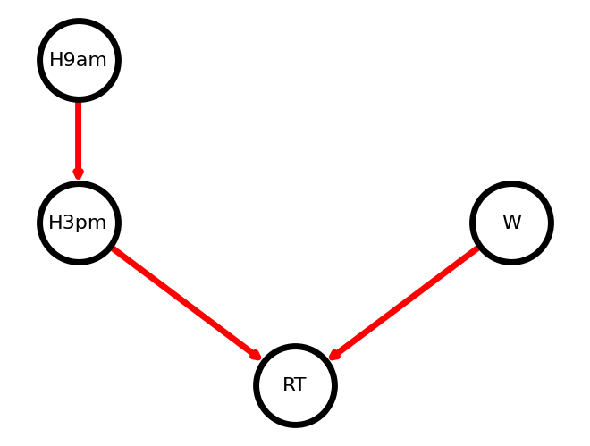

<H3> Name : Kavinraja D </H3>
<H3>Register No: 212222240047 </H3>
<H3> Experiment 1</H3>
<H3></H3>
<H1 ALIGN=CENTER> Implementation of Bayesian Networks</H1>

## Aim :
    To create a bayesian Network for the given dataset in Python
## Algorithm:
Step 1:Import necessary libraries: pandas, networkx, matplotlib.pyplot, Bbn, Edge, EdgeType, BbnNode, Variable, EvidenceBuilder, InferenceController 
Step 2:Set pandas options to display more columns 
Step 3:Read in weather data from a CSV file using pandas 
Step 4:Remove records where the target variable RainTomorrow has missing values 
Step 5:Fill in missing values in other columns with the column mean 
Step 6:Create bands for variables that will be used in the model (Humidity9amCat, Humidity3pmCat, and WindGustSpeedCat) 
Step 7:Define a function to calculate probability distributions, which go into the Bayesian Belief Network (BBN) 
Step 8:Create BbnNode objects for Humidity9amCat, Humidity3pmCat, WindGustSpeedCat, and RainTomorrow, using the probs() function to calculate their probabilities 
Step 9:Create a Bbn object and add the BbnNode objects to it, along with edges between the nodes 
Step 10:Convert the BBN to a join tree using the InferenceController 
Step 11:Set node positions for the graph 
Step 12:Set options for the graph appearance 
Step 13:Generate the graph using networkx 
Step 14:Update margins and display the graph using matplotlib.pyplot 

## Program:
## Import the libraries
~~~py
pip install pybbn
import pandas as pd # for data manipulation
import networkx as nx # for drawing graphs
import matplotlib.pyplot as plt # for drawing graphs
from pybbn.graph.dag import Bbn
from pybbn.graph.edge import Edge, EdgeType
from pybbn.graph.jointree import EvidenceBuilder
from pybbn.graph.node import BbnNode
from pybbn.graph.variable import Variable
from pybbn.pptc.inferencecontroller import InferenceController
pd.options.display.max_columns=50
~~~
### Read the dataset
~~~py
df=pd.read_csv('weatherAUS.csv',encoding='utf-8')
df=df[pd.isnull(df['RainTomorrow'])==False]

df=df.fillna(df.mean())

df['WindGustSpeedCat']=df['WindGustSpeed'].apply(lambda x: '0.<=40'   if x<=40 else '1.40-50' if 40<x<=50 else '2.>50')
df['Humidity9amCat']=df['Humidity9am'].apply(lambda x: '1.>60' if x>60 else '0.<=60')
df['Humidity3pmCat']=df['Humidity3pm'].apply(lambda x: '1.>60' if x>60 else '0.<=60')
print(df)

def probs(data, child, parent1=None, parent2=None):
    if parent1==None:
        # Calculate probabilities
        prob=pd.crosstab(data[child], 'Empty', margins=False, normalize='columns').sort_index().to_numpy().reshape(-1).tolist()
    elif parent1!=None:
            # Check if child node has 1 parent or 2 parents
            if parent2==None:
                # Caclucate probabilities
                prob=pd.crosstab(data[parent1],data[child], margins=False, normalize='index').sort_index().to_numpy().reshape(-1).tolist()
            else:
                # Caclucate probabilities
                prob=pd.crosstab([data[parent1],data[parent2]],data[child], margins=False, normalize='index').sort_index().to_numpy().reshape(-1).tolist()
    else: print("Error in Probability Frequency Calculations")
    return prob

H9am = BbnNode(Variable(0, 'H9am', ['<=60', '>60']), probs(df, child='Humidity9amCat'))
H3pm = BbnNode(Variable(1, 'H3pm', ['<=60', '>60']), probs(df, child='Humidity3pmCat', parent1='Humidity9amCat'))
W = BbnNode(Variable(2, 'W', ['<=40', '40-50', '>50']), probs(df, child='WindGustSpeedCat'))
RT = BbnNode(Variable(3, 'RT', ['No', 'Yes']), probs(df, child='RainTomorrow', parent1='Humidity3pmCat', parent2='WindGustSpeedCat'))
~~~
## Create Network :
~~~py
bbn = Bbn() \
    .add_node(H9am) \
    .add_node(H3pm) \
    .add_node(W) \
    .add_node(RT) \
    .add_edge(Edge(H9am, H3pm, EdgeType.DIRECTED)) \
    .add_edge(Edge(H3pm, RT, EdgeType.DIRECTED)) \
    .add_edge(Edge(W, RT, EdgeType.DIRECTED))
~~~
## Convert the BBN to a join tree
~~~py
join_tree = InferenceController.apply(bbn)
pos={0: (-1,0), 1: (-1, 0.5), 2: (1, 0), 3:(0,-0.5)}
~~~
## set options for graphlooks:
~~~py
options = {
    "font_size": 16,
    "node_size": 4000,
    "node_color": "yellow",
    "edgecolors": "blue",
    "edge_color": "purple",
    "linewidths": 5,
    "width": 5,}
~~~
## update margins and print graph
~~~py
ax = plt.gca()
ax.margins(0.10)
plt.axis("off")
plt.show()
~~~
## Output:

## Result:
   Thus a Bayesian Network is generated using Python

